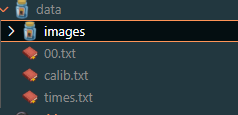

# Computer Vision Final Project Code
This is the code for the Computer Vision Final Project. In order to run the code you will need to obtain the kitti dataset and use kitti sequence 00 grayscale. The dataset folder should only contain the first 1001 images. The structure of the folder should be like so:



This dataset cannot be included in the repo at the request of the kitti team and must be downloaded seperately.

## Installation
To run the code you will need to follow a few simple steps.

# NOTE: This was tested on windows 11.

1. Create the dataset folder:
```bash
mkdir dataset
cd dataset
{Download the kitti data to this folder}
```

2. Install the required packages, either in virtual environment or main
```bash
pip install -r requirements.txt
```

3. Finally you should be able to run the code. The main.ipynb file contains the collection of experiments and can be run with a run all. Keep in mind this will take some time to get through due to the multiple steps of processing all 1001 frames. Alternatively you can run select cell blocks to get specific results.
